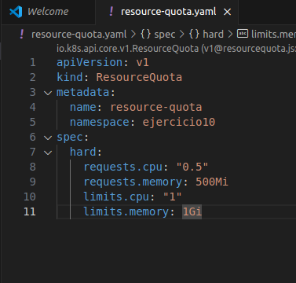
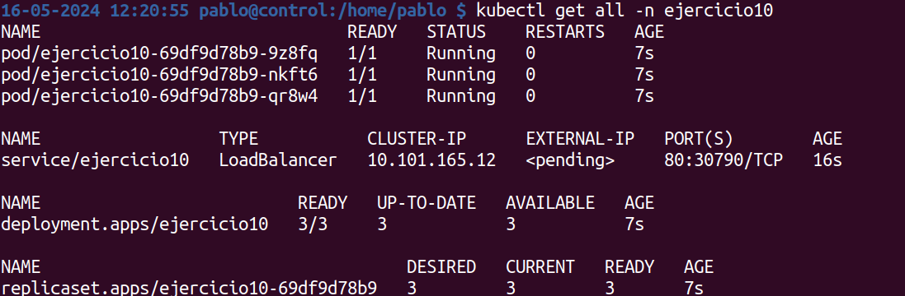
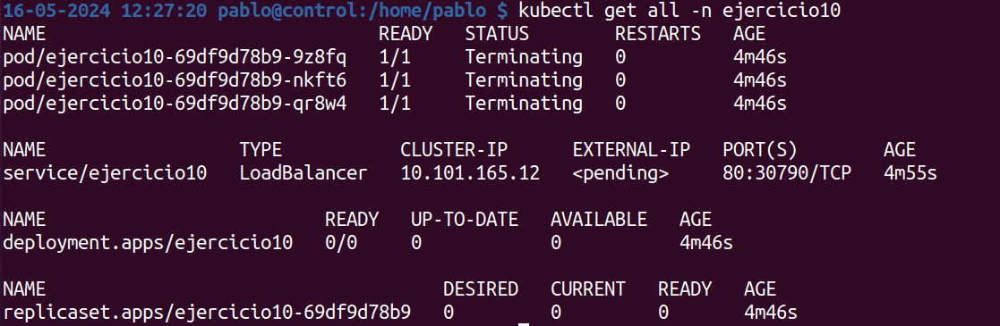

1. Crea un namespace con el nombre que prefieras, de manera IMPERATIVA.

kubectl create namespace ejercicio10

2. Aplica limitaciones de recursos a este namespace, de manera DECLARATIVA, para que no pueda usar más de 1 CPU y 1GB de memoria y como mínimo 0.5 CPU y 0.5GB de memoria.

Cremaos un fichero (manifiesto) para las limitaciones, en mi caso resource-quota.yaml

3. Despliega los elementos del ejercicio 8 en este namespace de manera DECLARATIVA

Para este punto ha habido que modifciar el color y colors-service y añadir la linea dentro de metadata del nombre del namespace

4. Lista todos los elementos del namespace para mostrar el resultado.

5. Haz lo necesario para que, sin borrar el deployment, no quede ningún POD levantado.

Para hacerlo, hay que escalar el deployment a cero con el siguiente comando:

kubectl scale deployment ejercicio10 --replicas=0 -n ejercicio10

6. Lista todos los elementos del namespace para mostrar el resultado.

