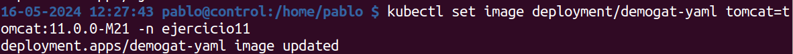
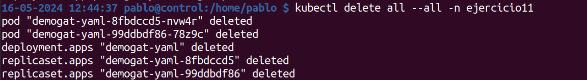

1. Crea un namespace con el nombre que prefieras.
    kubectl create namespace ejercicio11

2. Tomaremos el deployment del ejercicio 5 y lo modificaremos para que use la estrategia RollingUpdate.

    Añadimos la sección strategy a la especificación 

3. Despliega el deployment en el namespace creado.
    kubectl apply -f demogat-deployment.yaml
4. Modifica el deployment para usar una tag diferente de la imagen.

5. Actualiza el deployment para que use la nueva imagen.

    

6. Explica el proceso de actualización de la imagen.

    Primero se modifica la especificación del deployment para usar la nueva imagen 

    Luego se aplica la nueva especificación y como la estrategia de actualización está configurada como RollingUpdate, Kubernetes actualiza los Pods de forma gradual.

7. Limpia todos los recursos creados.

