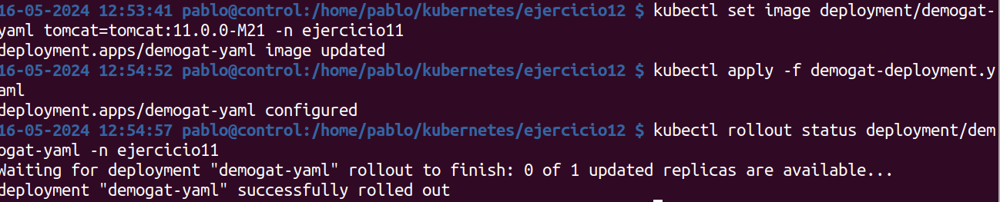

Realiza el ejercicio 11 pero en este caso, en lugar de usar la estrategia RollingUpdate, usa la estrategia Recreate.

En este ejercicio cambiamos el type de la estrategia 

Seteamos la imagen aplicamos, y luego hacemos el rollout para ver los cambios que sucede con la estrategia 

