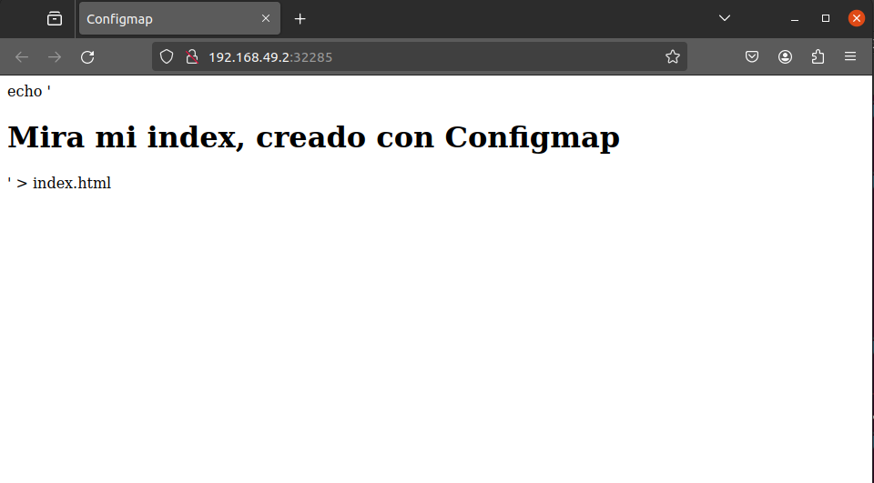

Primero creamos el index.html

Luego creamos el configmap con el siguiente comando :
    kubectl create configmap index-configmap --from-file=index.html

Después  creamos  el deployment y el service

Ejecutamos el siguiente comando:
    minikube service webserver-service

Y en el navegador se ve asi:

