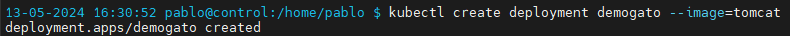
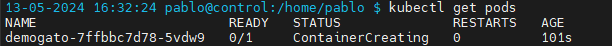
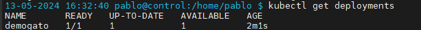
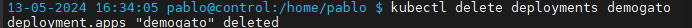
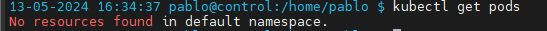

 Crea un objeto DEPLOYMENT con las siguientes caracteristicas:
- Nombre: "demogato" 
- Imagen: tomcat
- Créalo de manera IMPERATIVA.

Lista los POD.

Lista los DEPLOYMENT

Borra el DEPLOYMENT.

Lista los POD
