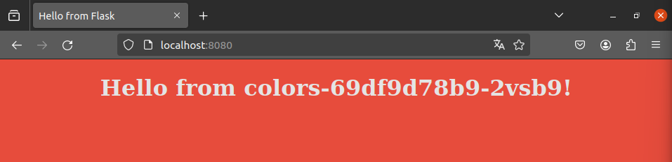

Para el ejercicio 8-1 he creado dos archivos el colors-deployment y el colors-service (.yaml ambos) 

El Deployment está configurado para mantener tres réplicas de la aplicación, cada una ejecutándose en su propio Pod.

El Service está configurado como un LoadBalancer, lo que significa que distribuirá el tráfico entrante entre los Pods del Deployment. El Service también está configurado para escuchar en el puerto 80 y redirigir el tráfico al puerto 8080 de los Pods.

posteriormente ejecutamos las órdenes :
kubectl apply -f colors-deployment.yaml
kubectl apply -f colors-service.yaml

Estos comandos crean o actualizan el Deployment y el Service definidos en los archivos .yaml. Si los recursos ya existen, kubectl apply los actualiza con las definiciones en los archivos .yaml. Si no existen, kubectl apply los crea.

Una vez que tengas el nombre del pod, puedes hacer un reenvío de puerto con el siguiente comando:

kubectl port-forward service/colors-service 8080:8080

de esta forma comprobamos si funcinoa en el navegador

