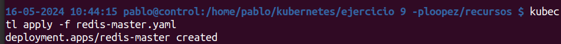

Primero hacemos el apply:

Comprobamos la lista de pods:

Comporbamos la liusta de deployments

Comporbamos la lista de replicasets del cluster 

Ejecutamos el apply del service y el listado 

Comprobamos la descripcion del servicio

Lanzamos el frontend

Y el frontend-service

Sabiendo la ip (192.168.49.2) y elk puerto en el que se ejecuta el frontend accedemos desde el navegador
